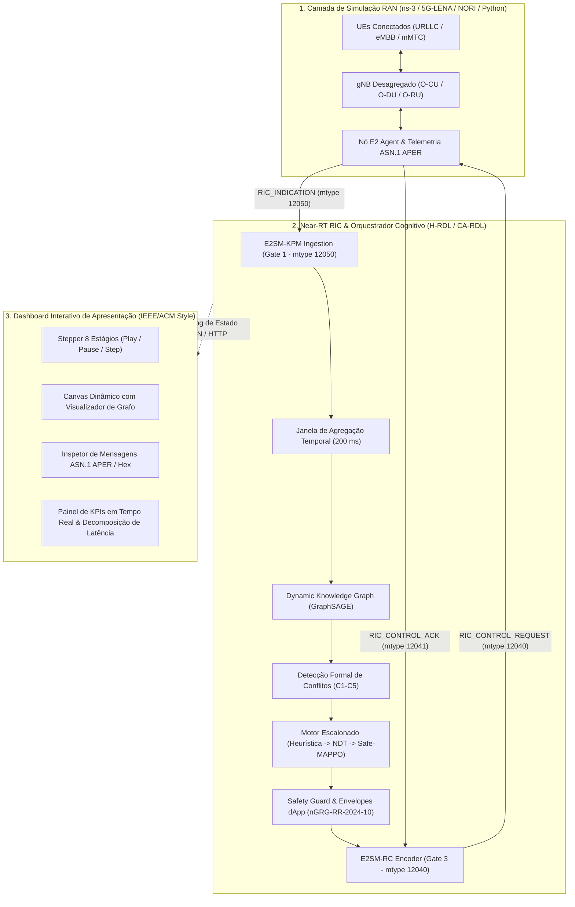

# Suíte de Demonstração Científica: H-RDL & CA-RDL em Tempo Real (5G-Adv / 6G O-RAN)

Este diretório contém a suíte completa de **demonstração interativa e em tempo real** para avaliação dos frameworks **H-RDL (Hierarchical Resource and Decision Layer)** e **CA-RDL (Cognitive Arbitration RDL)** no ecossistema O-RAN ALLIANCE.

A arquitetura e os passos de execução seguem o padrão metodológico internacional de plataformas de teste e validação aberta como **RIC-TaaP** (Orange / O-RAN SC), **Colosseum** e **OpenRAN Gym** (WiNES Lab / Northeastern University).

---

## 1. Visão Geral da Arquitetura de Demonstração



---

## 2. Estrutura de Arquivos

```
experiments/demonstration/
├── README.md                      # Este guia de execução passo a passo
├── demo_scenarios.py              # Definição dos 3 cenários de teste científicos (A, B e C)
├── rdl_demonstration_engine.py    # Motor de simulação FSM determinística e servidor web embutido
└── web/
    ├── index.html                 # Dashboard interativo com Canvas de Knowledge Graph e inspetor
    ├── demo_data_conflict_storm.json
    ├── demo_data_urllc_dapp.json
    └── demo_data_temporal_flapping.json
```

---

## 3. Guia de Execução Passo a Passo

### Opção A: Execução Integrada em Um Comando (Recomendado)

O motor possui um servidor HTTP embutido que gera os datasets e hospeda o dashboard automaticamente:

```powershell
# No PowerShell (Windows):
.venv\Scripts\python experiments/demonstration/rdl_demonstration_engine.py --serve --port 8080
```

```bash
# No Linux / WSL2:
source .venv/bin/activate
python experiments/demonstration/rdl_demonstration_engine.py --serve --port 8080
```

1. O terminal iniciará o servidor e exibirá: `Servidor de Demonstração Ativo em: http://localhost:8080/index.html`;
2. Abra o navegador no endereço: **`http://localhost:8080`**;
3. Clique em **"▶ Executar Passo a Passo"** para iniciar a simulação interativa.

---

### Opção B: Execução via Live Server (VSCode)

Se preferir utilizar a extensão **Live Server** do VSCode:
1. Gere os dados dos cenários:
   ```powershell
   .venv\Scripts\python experiments/demonstration/rdl_demonstration_engine.py --scenario all
   ```
2. No VSCode Explorer, clique com o botão direito no arquivo [`experiments/demonstration/web/index.html`](file:///c:/Users/george.barbosa/.gemini/antigravity/scratch/iqos-xapp-rdl-phase2/experiments/demonstration/web/index.html) e selecione **"Open with Live Server"**.

---

### Opção C: Integração com Simulação Física ns-3 / 5G-LENA / NORI (WSL2)

Para executar o cenário físico completo com o ns-3 e o nó E2 real:

1. **Terminal 1 (WSL2 / Linux - Near-RT RIC & Engine):**
   ```bash
   cd /mnt/c/Users/george.barbosa/.gemini/antigravity/scratch/iqos-xapp-rdl-phase2
   source .venv/bin/activate
   python experiments/demonstration/rdl_demonstration_engine.py --scenario conflict_storm --serve --port 8080
   ```

2. **Terminal 2 (WSL2 / Linux - Simulação Física ns-3):**
   ```bash
   cd ~/ns-3-dev
   ./ns3 run "scenario_rdl_closed_loop_nori --simTime=20.0 --enableE2=true"
   ```

---

## 4. Roteiro dos 8 Estágios da Demonstração (Mapeamento RIC-TaaP)

Ao navegar pelo dashboard, identifique cada um dos 8 estágios canônicos:

| Estágio | Nome & Descrição | Sinalização / Protocolo | O que Observar no Painel |
|---|---|---|---|
| **Estágio 1** | **Registro de UEs & Setup 5G**<br/>Ciclo canônico de 5 passos (PRACH $\to$ RRC $\to$ NAS $\to$ PDU $\to$ E2). | 3GPP TS 38.331 / TS 24.501 | Painel esquerdo: UEs passam de `SYNCING` para `CONNECTED_PDU_ACTIVE`. |
| **Estágio 2** | **Telemetria E2SM-KPM (Gate 1)**<br/>Ingestão de relatórios de telemetria ASN.1 APER. | `RIC_INDICATION` (mtype 12050) | Selo **Gate 1** ativo; inspetor exibe Hex ASN.1 e métricas (PRB %, SINR, Delay). |
| **Estágio 3** | **Janela de Ingestão de Propostas**<br/>Buffer de agregação temporal de 200 ms. | Propostas assíncronas xApps | Cartões roxos detalhando as intenções conflitantes (xSlice, xEnergy, xTS). |
| **Estágio 4** | **Knowledge Graph Dinâmico**<br/>Construção de grafo heterogêneo $G=(V,E)$. | GraphSAGE / GNN Topology | Canvas central organiza nós de UEs, Slices, Células e xApps em layout dinâmico. |
| **Estágio 5** | **Detecção de Conflitos**<br/>Classificação formal de conflitos (C1-C5). | Matriz de Conflitos $C(c,s)$ | Arestas de conflito piscam em **vermelho neon** no Canvas; alertas de severidade `CRITICAL`. |
| **Estágio 6** | **Arbitragem CA-RDL (Gate 2)**<br/>Escalonamento Heurística $\to$ NDT $\to$ Safe-MAPPO. | Safe-MAPPO & Lagrangianos | Selo **Gate 2** ativo ($t_{\text{decisão}} = 14.39\text{ ms} < 50\text{ ms}$); política conjunta ótima. |
| **Estágio 7** | **Safety Guard & Envelopes dApp**<br/>Bounding box $\Omega_{\text{dApp}}$ para O-DU ($< 1\text{ ms}$). | nGRG-RR-2024-10 Bounding Box | Cartão roxo com os limites de operação autônoma da dApp no TTI. |
| **Estágio 8** | **Atuação E2SM-RC (Gate 3/4)**<br/>Despacho de controle e confirmação física na RAN. | `RIC_CONTROL_REQ` (12040) / ACK (12041) | Selos **Gate 3 e Gate 4** ativos; latência URLLC cai para **0.82 ms** e energia cai em **-17.7%**. |

---

## 5. Cenários Científicos Disponíveis

No topo do dashboard, você pode alternar entre 3 cenários científicos predefinidos:

- **Cenário A (*Conflict Storm*):** Disputa severa de recursos entre 3 xApps (QoS Slicing, Energy-Saving e Traffic-Steering). Demonstra a escalada automática até o **Nível 3 (Safe-MAPPO)** com mitigação simultânea de conflitos diretos e indiretos.
- **Cenário B (*URLLC Fast Preemption & dApp Envelopes*):** Demonstra o modelo **Two-Tier AI** (SMO/RIC $\to$ dApp). O Near-RT RIC despacha envelopes $\Omega_{\text{dApp}}$, e a dApp co-localizada no O-DU executa preempção em microsegundos no TTI ($< 1\text{ ms}$) em conformidade com o relatório **O-RAN nGRG-RR-2024-10**.
- **Cenário C (*Temporal Flapping Elimination*):** Duas xApps operando em frequências discordantes geram oscilação cíclica *ping-pong*. O CA-RDL detecta o ciclo temporal no Knowledge Graph e impõe janela de resfriamento (*lockout*) de 5 segundos.

---

## 6. Testes Automatizados e Homologação

Para executar a suíte de testes de regressão e conformidade com `pytest`:

```powershell
# Executar testes específicos da suíte de demonstração:
.venv\Scripts\pytest tests/test_rdl_demonstration.py -v

# Executar a suíte completa de testes do projeto:
.venv\Scripts\pytest -q
```

**Critérios de Homologação dos 4 Gates O-RAN:**
- **Gate 1 (Real Telemetry):** Mensagens `RIC_INDICATION` codificadas em ASN.1 APER (mtype 12050) válidas.
- **Gate 2 (Deterministic Decision):** Latência de arbitragem computacional delimitada ($14.39\text{ ms} < 50\text{ ms}$).
- **Gate 3 (Real Control & ACK):** Handshake de `RIC_CONTROL_REQUEST` (12040) e `RIC_CONTROL_ACK` (12041) com IDs canônicos.
- **Gate 4 (Closed-Loop Response):** Variação causal comprovada nos KPIs físicos da RAN (queda de latência URLLC e redução do consumo de potência).
